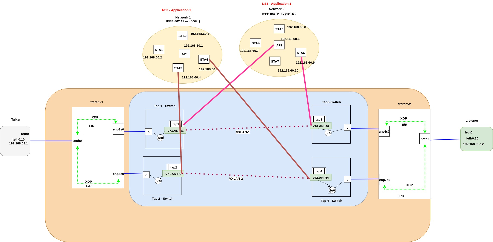

# Project Status: 
Complete

# Desription
This project integrates multiple components to evaluate the **IEEE 802.1CB Frame Replication and Elimination for Reliability (FRER)** standard. 


# Pre-requisites
- Supported Operating Systems
  - Ubuntu 20.04+ (tested)
  - Any Linux distribution with kernel ≥ 5.4
  - A **multi-core CPU**, preferably 10th generation or newer
- Internal dependencies
  - Programming languages: C++ (for NS-3), Python 3 (analysis scripts), Bash
  - Build tools: GNU Make, g++
  - Libraries: Standard NS-3 modules
- External dependencies
  - [NS3.41](https://www.nsnam.org/)
  - [XDP FRER implementation from Ericsson Research Lab](https://github.com/EricssonResearch/xdpfrer)
  - Linux network namespaces


##  Precautions

This setup is CPU-intensive. To avoid inaccurate results or system overload:

- Run **each NS-3 instance on a different core** (e.g., using `taskset`)
- Avoid 100% CPU usage by doing any of following:
  - Reducing the outside traffic data rate (ping rate in our case)
  - Disabling `.pcap` packet tracing in NS-3
  - Using larger packet sizes and lower traffic rates (inside NS-3)
- Close all unnecessary apps (e.g., browsers, editors)


# How to install it 
No pre-built binaries are shipped. Follow the NS-3 installation instructions and XDP FRER setup from their respective sources.

# How to build it

### Step 1: Prepare NS-3 Instances

From Ns-3 folder copy `WLAN1.cc` and `WLAN2.cc` into each NS-3 instance's `scratch/` directory:

```bash
'/your_path/Ns3-41_1/ns-3.41/scratch/WLAN1.cc'
'/your_path/Ns3-41_2/ns-3.41/scratch/WLAN2.cc'
```


### Step 2: Run NS-3 in Parallel (on Separate Cores)
Open two terminal windows and run the following:

**Terminal 1**
```bash
taskset -c 1 ./ns3 run --enable-sudo scratch/tap-wifi-dumbbell
```

**Terminal 2**
```bash
taskset -c 3 ./ns3 run --enable-sudo scratch/tap-wifi-dumbbell
```
This launches both NS-3 simulations. Each will run for several hours.


### Step 3: Set Up FRER Script
Copy Integration.sh from the FRER folder into the test/ directory of your XDP/FRER setup.


### Step 4: Run FRER
Open a third terminal:

```bash
sudo su
cd /path/to/frer/test

source Integration.sh

```

### Step 5: Send Dummy Traffic
Open a fourth terminal to start traffic from the talker namespace:

```bash
sudo ip netns exec talker bash
ping -D -i 0.01 -s 1400 192.168.62.12 | tee ping_output.txt
```


This sends 1400B packets every 10ms to the listener. You can:
Verify this in Wireshark on the listener side

Observe channel occupancy in WLAN1Occupancy.txt and WLAN2Occupancy.txt  generated by NS-3


📂 Outputs
ping_output.txt: Shows real-time ping statistics

channel occupancy: Captures channel utilization in NS-3


# Technical description 


This project integrates multiple components to evaluate the **IEEE 802.1CB Frame Replication and Elimination for Reliability (FRER)** standard. It combines:

- **XDP/BPF-based FRER implementation** by Ericsson Research Lab (available online)
- **NS-3**, an open-source network simulator
- **Linux containers/namespaces**
- Goal is to run **dummy traffic** over a FRER switch, which:
  -  Replicates traffic over two links
  -  Receives traffic via a Wireless LAN (simulated in NS-3)
  -  The setup is extendable to real hardware and other traffic types and other networks (WLAN, 5G, Ethernet — as supported by NS-3)


# Source
This code has been developed within the research / innovation project 5GSmartFact. This project has received funding from the European Union’s Horizon 2020 research and innovation programme under the Marie Skłodowska-Curie grant agreement ID 956670. This project started on 1 March 2021 and will end on 31 December 2025, funded under H2020-EU.1.3.1 of the Horizon 2020 Framework Programme.  
More information about the grant at https://cordis.europa.eu/project/id/956670


# Copyright
This code has been developed by Fundació Privada Internet i Innovació Digital a Catalunya (i2CAT). i2CAT is a *non-profit research and innovation centre* that  promotes mission-driven knowledge to solve business challenges, co-create solutions with a transformative impact, empower citizens through open and participative digital social innovation with territorial capillarity, and promote pioneering and strategic initiatives.
i2CAT *aims to transfer* research project results to private companies in order to create social and economic impact via the out-licensing of intellectual property and the creation of spin-offs.
Find more information of i2CAT projects and IP rights at https://i2cat.net/tech-transfer/


# License
This code is licensed under the terms *Affero GPL v3*. Information about the license can be located at https://www.gnu.org/licenses/agpl-3.0.en.html.

# Attribution Notice
This work uses third-party components that are attributed as follows:

* Unmodified version of NS-3.41 — Copyright © 2006–2025 The ns-3 project — licensed under GPL v2
* Unmodified/modified version of XDP FRER implementation — Copyright © 2024 Ericsson Research — licensed under BSD 2-Clause License


